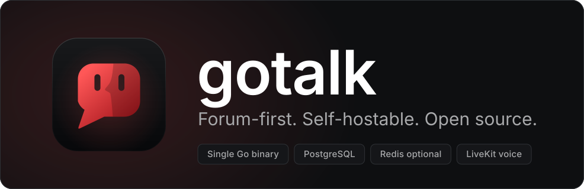

<p align="center">
  
</p>

<p align="center">
  <a href="https://github.com/parkerbrown98/gotalk-server/actions/workflows/ci.yml"></a>
  <a href="https://github.com/parkerbrown98/gotalk-server/releases"></a>
</p>

<p align="center">
  <a href="docs/getting-started.md">Getting started</a> ·
  <a href="docs/configuration.md">Configuration</a> ·
  <a href="docs/deployment.md">Deployment</a> ·
  <a href="docs/api-overview.md">API</a> ·
  <a href="docs/README.md">All docs</a>
</p>

# gotalk-server

The backend for Gotalk, a forum-first, self-hostable alternative to Discord. Communities get
traditional, searchable forum boards and topics alongside real-time chat, direct messages and
voice, and any client can connect to any instance.

## Table of contents

- [Highlights](#highlights)
- [Quick start](#quick-start)
- [Documentation](#documentation)
- [What's included](#whats-included)
- [Connecting a client](#connecting-a-client)
- [Development](#development)

## Highlights

- Single static Go binary (~20 MB distroless image), PostgreSQL required, Redis and LiveKit optional
- Browser setup wizard **or** fully headless setup from environment variables; the same page
  lets administrators change storage, email, voice and CORS later
- Runs anywhere from a Raspberry Pi to Kubernetes: Docker Compose, a Helm chart, plain
  manifests, and 12-factor configuration
- Pluggable file storage (local disk or any S3-compatible store) and email (SMTP, SendGrid,
  Mailgun, Postmark, Resend, Amazon SES)
- Any client can point at any instance: discovery via `/.well-known/gotalk-instance`
  and `GET /api/v1/instance`
- OpenAPI 3.1 spec and interactive docs served at `/api/v1/docs`; real-time events over a
  WebSocket at `/api/v1/gateway`

## Quick start

```sh
docker compose up -d
docker compose logs gotalk     # copy the setup link it prints
```

Open the link (`http://localhost:8080/setup?token=…`) and the wizard walks you through
pre-flight checks, naming your instance, the administrator account, file storage, email and
optional voice. For anything beyond trying it out locally, copy [.env.example](.env.example) to
`.env` and set at least `POSTGRES_PASSWORD` and `GOTALK_SERVER_PUBLIC_URL`.

More in [Getting started](docs/getting-started.md): headless setup, trying email with Mailpit,
changing settings later and enabling voice.

## Documentation

**Run it**

| Page | What's in it |
|---|---|
| [Getting started](docs/getting-started.md) | Docker Compose quick start, headless setup, changing settings later, voice channels |
| [Commands and running the binary](docs/cli.md) | Prebuilt binaries, building from source, every `gotalk` command |
| [Configuration](docs/configuration.md) | Every setting, grouped by area, with defaults |
| [File storage and email](docs/storage-and-email.md) | Local and S3-compatible storage, email providers, custom drivers |
| [Backup and restore](docs/backup-and-restore.md) | Consistent backups, restores, moving between storage backends |
| [Deployment](docs/deployment.md) | Kubernetes (Helm and Kustomize), cloud and multi-replica deployments, probes, reverse proxies |

**Use the API**

| Page | What's in it |
|---|---|
| [API overview](docs/api-overview.md) | Connecting a client, authentication, password reset, errors and rate limits |
| [Instance and uploads](docs/api-instance.md) | Instance settings, avatar and icon uploads, attachments, link previews |
| [Places, roles and boards](docs/api-places.md) | Places, permissions, board overwrites, reading without an account |
| [Forum](docs/api-forum.md) | Topics and posts, read state, feeds, search, drafts |
| [Chat and messaging](docs/api-chat.md) | Channels, threads, messages, direct messages, presence |
| [Voice](docs/api-voice.md) | Voice channels, moderation, call quality |
| [Moderation and policies](docs/api-moderation.md) | Reports, bans, audit log, policies and consent, transparency |
| [Developers](docs/api-developers.md) | API tokens, bots and slash commands, webhooks |
| [Real-time gateway](docs/gateway.md) | WebSocket protocol, events, close codes |
| [Endpoint reference](docs/api-reference.md) | Every endpoint grouped by area |

**Contribute**

| Page | What's in it |
|---|---|
| [Development](docs/development.md) | Tests, linting, schema changes, source layout |
| [Backend plan](docs/backend-plan.md) | The full feature breakdown, technology stack and phases |

## What's included

This repository implements Phases 1 to 7 of the [backend plan](docs/backend-plan.md):

| Phase | Adds |
|---|---|
| 1. Foundation | Accounts, places, roles and permissions, invites and bans, the first-run setup wizard |
| 2. Forum core | Boards, topics and posts, full-text search, notifications, moderation basics |
| 3. Real-time layer | Chat channels and threads, direct and group messages, presence, the WebSocket gateway |
| 4. Voice | Voice and video channels routed through a self-hosted [LiveKit](https://livekit.io) server, voice permissions |
| 5. Platform maturity | Public API with rate limiting, webhooks and bots, policy and transparency endpoints, instance discovery |
| 6. Topic feeds | Ranked feeds per place and instance-wide, topic voting, cursor paging, read tracking |
| 7. Self-hosting and cloud polish | Headless setup and pre-flight checks, CORS, Helm chart and Kubernetes manifests, managed dependencies, backup and restore, storage and email plugins |

## Connecting a client

Given only a domain, a client fetches `/.well-known/gotalk-instance` to find the API base URL
and gateway URL, then `GET /api/v1/instance` for the instance name, registration mode,
supported API versions, feature flags and limits. See the
[API overview](docs/api-overview.md) and the [real-time gateway](docs/gateway.md). The official
client lives in [gotalk-client](https://github.com/parkerbrown98/gotalk-client).

## Development

Requirements: Go 1.27+ and Docker (for integration tests and `sqlc`).

```sh
go test ./...                      # unit + integration tests (starts PostgreSQL/Redis containers)
golangci-lint run ./...            # lint, same config as CI
```

See [Development](docs/development.md) for schema changes, `sqlc` and the source layout.
